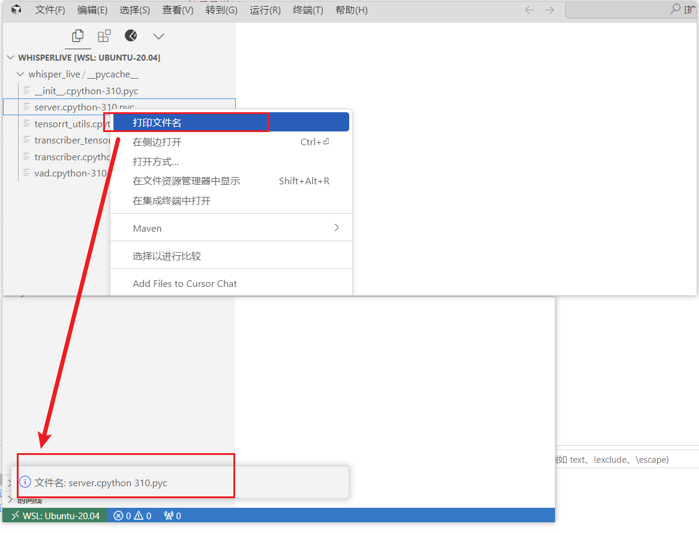

# 最简单的 VSCode 插件示例

这是一个最简单的 Visual Studio Code 插件示例项目,帮助开发者快速入门 VSCode 插件开发。

## 主要功能

- 插件激活时显示欢迎消息
- 支持在文件资源管理器中右键打印文件名



## 开发环境准备

1. 克隆代码仓库:
   ```bash
   git clone https://github.com/yourusername/SimplestVSCodeExtension.git
   ```

2. 安装依赖:
   ```bash
   npm install
   ```

## 使用说明

1. 在 VSCode 中按 `F5` 启动调试
2. 新窗口中插件会自动激活并显示欢迎消息
3. 在文件资源管理器中右键文件,选择"打印文件名"即可使用功能

## 核心代码示例
